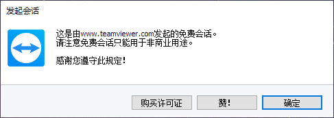

# Kill Teamviewer Window

[GitHub](https://github.com/richex-cn/KillTeamviewerWindow)

## 介绍

这是一个用于在使用 Teamviewer 结束远程会话时自动点击确定按钮关闭提示窗口的工具。

Teamviewer 在远程控制结束后，会在主控端和被控端都弹出如下的窗口：

如果是远程协助双方有人控制的情况这个提示无伤大雅，但如果是远控服务器、并进行录屏操作时，这个提示窗口会在断开连接后会一直存在遮挡屏幕内容并且无法关闭。所以简单制作了一个工具监控窗口并自动点击确定按钮。

## 使用

打开 `KillTeamviewerWindow.exe` 并保持运行即可。
